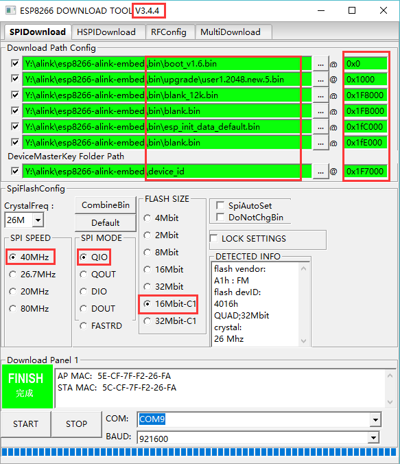
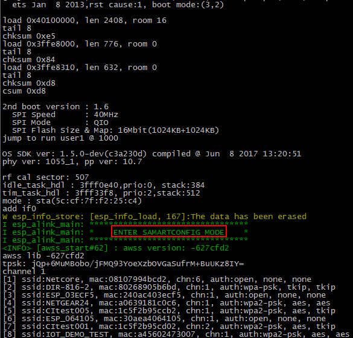

本工程为阿里云 ALINK EMBED 接口使用示例，你可以通过本示例了解 ALINK 配网、升级及数据传输等。

## 开发板准备和介绍


    标号 1 开关拨下（拨下为断电状态，拨上为上电状态）；
    标号 2 开关拨下（拨下为下载模式，拨上为运行模式）；
    标号 3 开关拨上（CHIP_EN PIN，默认拨上即可）；
    标号 4 跳线帽插入上方的两个针脚；
    标号 5 插入跳线帽；
    标号 6 配网开关，短按（<3s）激活设备，长按（>=3s）设备进入配网模式；
    标号 9 出厂设置开关，长按（>=3s）设备端会解绑并恢复出厂设置；
    标号 10 焊接 GPIO4 与 SW2 旁边的小圆孔，使能 SW2 按键，即出厂设置开关。

## 获取示例工程
要获取 ALINK EMBED 示例项目，请使用以下命令：

```
git clone --recursive https://zzchen@gitlab.espressif.cn:6688/customer/esp8266-ecovacs-alink-embed.git
```

## 编译环境的搭建
您可以使用 xcc 和 gcc 来编译项目，建议使用 gcc。对于 gcc，请参考[esp-open-sdk](https://github.com/pfalcon/esp-open-sdk)。

## 配置与编译
1. **配置**，您可以通过修改 Makefile 下的配置，配置日志等级、数据包的大小等
2. **编译**，直接运行本工程下的 gen_misc.sh，如：

```
./gen_misc.sh
```

## 固件烧写
1. 安装[串口驱动](http://www.usb-drivers.org/ft232r-usb-uart-driver.html)
2. 烧录相关 bin 文件，ESP8266 开发板中标号 1 拨上，给开发板上电；标号 2 开关拨下，进入下载状态。



    boot.bin------------------->0x000000    // 启动程序
    user1.2048.new.5.bin------->0x01000     // 主程序
    blank.bin------------------>0x1F8000    // 初始化用户参数区
    blank.bin------------------>0x1FB000    // 初始化 RF_CAL 参数区。
    esp_init_data_default.bin-->0x1FC000    // 初始化其他射频参数区
    blalk.bin------------------>0x1FE000    // 初始化系统参数区

3.将 ESP8266 开发板标号 2 开关拨上，设置开发板为运行模式；将标号 1 开关拨上，给开发板上电，出现“ENTER SAMARTCONFIG MODE”信息，即表示 ALINK 程序正常运行，进入配网模式。



## 运行与调试
1. 下载阿里[智能厂测包](https://open.aliplus.com/download)，
2. 登陆淘宝账号
3. 开启配网模组测试列表：
    - 安卓：点击“环境切换”，勾选“开启配网模组测试列表”
    - 苹果：点击“AKDebug”->测试选项，勾选“仅显示模组认证入口”
4. 添加设备：添加设备->“分类查找”中查找对应的类别->模组认证->V3 配网_热点配网(透传模式选择名称带LUA标识的)
5. 按键说明：
    - 激活设备：单击 IO13_RESET_KEY 按键（<3s）
    - 重新配网：长按 IO13_RESET_KEY 按键（>=3s）
    - 出厂设置：长按 SW2 按键（>=3s）

## 注意事项
- 模组不支持 5G 网络，请确认已关闭路由器 5G 网络功能
- 测试热点配网时，请确认 4G 网络处于开启状态

## Related links
- ESP8266 入门指南 : http://espressif.com/zh-hans/support/explore/get-started/esp8266/getting-started-guide
- 阿里智能开放平台：https://open.aliplus.com/docs/open/
- 烧录工具  : http://espressif.com/en/support/download/other-tools
- 串口驱动  : http://www.usb-drivers.org/ft232r-usb-uart-driver.html

